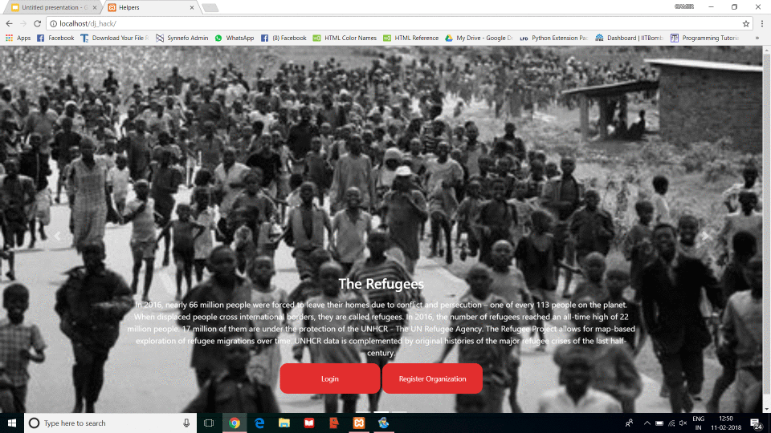

<p align="center">
  <a href="" rel="noopener">
 </a>
</p>

<h3 align="center">Common Database for Refugee Organizations</h3>

------------------------------------------

>There are no common database platform to communicate and search a particular refugee from any organization in different refugee managing organizations.We've built a website for different refugee managing organizations to have a common database platform to communicate and search a particular refugee from any organization and It also helps organizations to send email to  other organizations and ask for  aid in case of any emergency just by `click of a button`.
 . 


<div align="center">
"You know, those of us who leave our homes in the morning and expect to find them there when we go back - it's hard for us to understand what the experience of a refugee might be like."  -  <a href ="https://github.com/priyamshah112"> Priyam </a>
</div>


------------------------------------------
### Features

- `AID` send a mail for medical aid to nearby hospitals,organizations etc.
- `Resource` send a mail for Food,Clothes to different organizations.
- `Transfer Refugee` send a mail for Transferring Refugees to different organizations.
- `Search` based on name and age
- `Add Refugee` to add a refugee from a organization

<h3 > Rescue World As Website </h3>
<br>
<p align="center">

</p>
</div>

------------------------------------------

### Add-Ons

- [ ] Using Google-Map Api for nearby hospitals,places searching.
- [ ] Add More

------------------------------------------
### File Structure


#### Website

- `HTML` : front_p.html is the starting point of website , login1.html contains login and signup page , refugee_signup.html contains refugee signup page , aid.html contains all mail related services with mailing categories.
- `css` : contains full-slider.css for carousel of main page , style.css for all html files
- `javascript` : java.js common javascript file
- `php` : db.php for database intialization , download.php for image downloading , help1.php for mailing in various categories , index.php for including html files , login.php for taking user info in sql , logout.php for stopping sessions , refugee.php for storing refugee data , search.php for age,name based search etc
- `sql` : 3 tables hospital,organization and refugee
- `upload` : images of refugee

------------------------------------------
### Installation

* Install dependencies
```sh
        $ git clone https://github.com/RescueWorld/Web-Project.git
```
* Used PostCast Server for mailing system 
```
  $ http://www.postcastserver.com/default.aspx?a=nf
```
* Also require to change in php.ini for sending mail to localhost
* import the sql file to your database
* start execution from running front_p.html

------------------------------------------
### Contributing

 We're are open to `enhancements` & `bug-fixes`

### Note
- This project was done under `24 hours with minimal pre-preparation`
------------------------------------------
### Contributors

- [@priyamshah112](https://github.com/priyamshah112)
- [@devanshslnk](https://github.com/devanshslnk)
------------------------------------------
